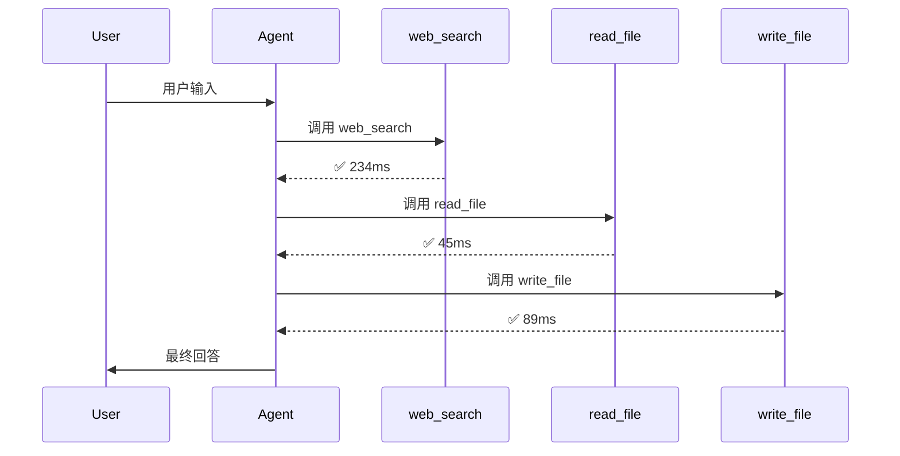

# 197 - Agent 工具调用链路可视化与 Debug 热图

> **核心思想：** Agent 调用了一堆工具，但你看不见发生了什么。可视化让黑盒变玻璃盒——调用序列一目了然，热点瓶颈秒级定位。

---

## 为什么需要可视化？

```
用户输入
  ↓
[LLM 思考] → tool_call: search_web
  ↓
[LLM 思考] → tool_call: read_file
                         ↓
                    tool_call: parse_json ← 嵌套？并行？顺序？
  ↓
[LLM 思考] → tool_call: write_file
  ↓
最终回答
```

光看日志你看到的是一堆 JSON。可视化你看到的是：
- **调用序列图**：谁先谁后，有没有并发
- **时间火焰图**：哪个工具最慢，卡在哪里
- **热图**：哪些工具被频繁调用，哪些几乎不用
- **错误分布**：哪个工具最容易挂

---

## 核心数据结构：ToolCallTrace

```typescript
// 每次工具调用记录一条 Trace
interface ToolCallTrace {
  id: string;              // 唯一 ID
  toolName: string;        // 工具名
  sessionId: string;       // 所属会话
  turnIndex: number;       // 第几轮对话
  callIndex: number;       // 本轮第几次调用
  parentId?: string;       // 父调用 ID（sub-agent 场景）
  
  startMs: number;         // 开始时间戳
  endMs?: number;          // 结束时间戳
  durationMs?: number;     // 耗时
  
  status: 'pending' | 'success' | 'error' | 'timeout';
  inputTokens?: number;    // 参数大小（估算）
  outputTokens?: number;   // 结果大小（估算）
  
  error?: string;          // 错误信息
  tags?: string[];         // 自定义标签
}

// 一次完整会话的调用图
interface CallGraph {
  sessionId: string;
  traces: ToolCallTrace[];
  totalDurationMs: number;
  toolStats: Record<string, ToolStats>;
}

interface ToolStats {
  callCount: number;
  totalDurationMs: number;
  avgDurationMs: number;
  errorCount: number;
  p95DurationMs: number;
}
```

---

## Step 1：透明中间件自动采集

不改任何工具代码，在分发层插入采集中间件：

```typescript
// tool-trace-middleware.ts
import { randomUUID } from 'crypto';

class ToolTraceCollector {
  private traces: Map<string, ToolCallTrace[]> = new Map();
  
  // 创建透明包装
  wrap<T extends (...args: any[]) => Promise<any>>(
    toolName: string,
    fn: T,
    sessionId: string
  ): T {
    return (async (...args: any[]) => {
      const trace: ToolCallTrace = {
        id: randomUUID(),
        toolName,
        sessionId,
        turnIndex: this.getTurnIndex(sessionId),
        callIndex: this.getCallIndex(sessionId),
        startMs: Date.now(),
        status: 'pending',
      };
      
      this.addTrace(sessionId, trace);
      
      try {
        const result = await fn(...args);
        
        trace.endMs = Date.now();
        trace.durationMs = trace.endMs - trace.startMs;
        trace.status = 'success';
        trace.outputTokens = this.estimateTokens(JSON.stringify(result));
        
        return result;
      } catch (err) {
        trace.endMs = Date.now();
        trace.durationMs = trace.endMs - trace.startMs;
        trace.status = 'error';
        trace.error = String(err);
        throw err;
      }
    }) as T;
  }
  
  private estimateTokens(text: string): number {
    return Math.ceil(text.length / 4); // 粗略估算
  }
  
  addTrace(sessionId: string, trace: ToolCallTrace) {
    if (!this.traces.has(sessionId)) {
      this.traces.set(sessionId, []);
    }
    this.traces.get(sessionId)!.push(trace);
  }
  
  getCallGraph(sessionId: string): CallGraph {
    const traces = this.traces.get(sessionId) ?? [];
    return {
      sessionId,
      traces,
      totalDurationMs: this.calcTotalDuration(traces),
      toolStats: this.calcStats(traces),
    };
  }
  
  private calcStats(traces: ToolCallTrace[]): Record<string, ToolStats> {
    const groups: Record<string, ToolCallTrace[]> = {};
    for (const t of traces) {
      if (!groups[t.toolName]) groups[t.toolName] = [];
      groups[t.toolName].push(t);
    }
    
    const stats: Record<string, ToolStats> = {};
    for (const [name, calls] of Object.entries(groups)) {
      const durations = calls
        .filter(c => c.durationMs !== undefined)
        .map(c => c.durationMs!)
        .sort((a, b) => a - b);
      
      stats[name] = {
        callCount: calls.length,
        totalDurationMs: durations.reduce((a, b) => a + b, 0),
        avgDurationMs: durations.length ? durations.reduce((a, b) => a + b, 0) / durations.length : 0,
        errorCount: calls.filter(c => c.status === 'error').length,
        p95DurationMs: durations[Math.floor(durations.length * 0.95)] ?? 0,
      };
    }
    return stats;
  }
  
  private calcTotalDuration(traces: ToolCallTrace[]): number {
    if (traces.length === 0) return 0;
    const start = Math.min(...traces.map(t => t.startMs));
    const end = Math.max(...traces.filter(t => t.endMs).map(t => t.endMs!));
    return end - start;
  }
  
  private getTurnIndex(sessionId: string): number {
    // 从会话上下文获取，简化实现
    return 0;
  }
  
  private getCallIndex(sessionId: string): number {
    return (this.traces.get(sessionId) ?? []).length;
  }
}

export const traceCollector = new ToolTraceCollector();
```

---

## Step 2：生成 Mermaid 序列图

```typescript
// mermaid-generator.ts

function generateSequenceDiagram(graph: CallGraph): string {
  const lines: string[] = [
    'sequenceDiagram',
    '    participant User',
    '    participant Agent',
  ];
  
  // 收集所有工具名
  const tools = [...new Set(graph.traces.map(t => t.toolName))];
  for (const tool of tools) {
    lines.push(`    participant ${sanitize(tool)}`);
  }
  
  lines.push('');
  lines.push('    User->>Agent: 用户输入');
  
  for (const trace of graph.traces) {
    const tool = sanitize(trace.toolName);
    const status = trace.status === 'error' ? '❌' : '✅';
    const duration = trace.durationMs ? `${trace.durationMs}ms` : '...';
    
    lines.push(`    Agent->>${tool}: 调用 ${trace.toolName}`);
    
    if (trace.status === 'error') {
      lines.push(`    ${tool}-->>Agent: ❌ ${trace.error?.slice(0, 50)}`);
    } else {
      lines.push(`    ${tool}-->>Agent: ${status} ${duration}`);
    }
  }
  
  lines.push('    Agent->>User: 最终回答');
  
  return lines.join('\n');
}

function sanitize(name: string): string {
  return name.replace(/[^a-zA-Z0-9_]/g, '_');
}

// 使用示例
const diagram = generateSequenceDiagram(graph);
console.log('```mermaid');
console.log(diagram);
console.log('```');
```

**输出示例：**



---

## Step 3：ASCII 火焰图时间线

在终端直接可视化，零依赖：

```typescript
// ascii-flamegraph.ts

function renderFlamegraph(graph: CallGraph, width = 80): string {
  if (graph.traces.length === 0) return '(no traces)';
  
  const start = Math.min(...graph.traces.map(t => t.startMs));
  const end = Math.max(...graph.traces.filter(t => t.endMs).map(t => t.endMs!));
  const totalMs = end - start;
  
  const lines: string[] = [];
  lines.push(`┌${'─'.repeat(width - 2)}┐`);
  lines.push(`│ 时间线: ${totalMs}ms total ${' '.repeat(width - 22)}│`);
  lines.push(`├${'─'.repeat(width - 2)}┤`);
  
  for (const trace of graph.traces) {
    const traceStart = trace.startMs - start;
    const traceEnd = (trace.endMs ?? Date.now()) - start;
    
    const startX = Math.floor((traceStart / totalMs) * (width - 20));
    const endX = Math.min(
      Math.ceil((traceEnd / totalMs) * (width - 20)),
      width - 20
    );
    const barLen = Math.max(1, endX - startX);
    
    const color = trace.status === 'error' ? '🔴' : '🟢';
    const label = trace.toolName.slice(0, 12).padEnd(12);
    const bar = '█'.repeat(barLen);
    const durationStr = trace.durationMs ? `${trace.durationMs}ms` : '...';
    
    const padding = ' '.repeat(Math.max(0, startX));
    lines.push(`│ ${label} ${color} ${padding}${bar} ${durationStr}`.padEnd(width - 1) + '│');
  }
  
  lines.push(`└${'─'.repeat(width - 2)}┘`);
  return lines.join('\n');
}
```

**输出示例：**

```
┌──────────────────────────────────────────────────────────────────────────────┐
│ 时间线: 1247ms total                                                          │
├──────────────────────────────────────────────────────────────────────────────┤
│ web_search   🟢 ████████████████████                                234ms    │
│ read_file    🟢                     ████                             45ms    │
│ parse_json   🟢                         ██                           12ms    │
│ write_file   🟢                           ████████                   89ms    │
│ exec_cmd     🔴                                    ████████████      timeout  │
└──────────────────────────────────────────────────────────────────────────────┘
```

---

## Step 4：工具热图（调用频率 × 耗时）

```typescript
// tool-heatmap.ts

interface HeatCell {
  toolName: string;
  callCount: number;
  avgDurationMs: number;
  errorRate: number;
  heatScore: number; // 综合热度分
}

function computeHeatmap(stats: Record<string, ToolStats>): HeatCell[] {
  const cells: HeatCell[] = Object.entries(stats).map(([name, s]) => ({
    toolName: name,
    callCount: s.callCount,
    avgDurationMs: s.avgDurationMs,
    errorRate: s.callCount ? s.errorCount / s.callCount : 0,
    // 热度 = 调用次数 × 平均耗时 + 错误率权重
    heatScore: s.callCount * s.avgDurationMs + s.errorCount * 5000,
  }));
  
  return cells.sort((a, b) => b.heatScore - a.heatScore);
}

function renderHeatmap(cells: HeatCell[]): string {
  const maxScore = cells[0]?.heatScore ?? 1;
  const lines: string[] = ['🔥 工具热图（调用数 × 耗时）\n'];
  
  for (const cell of cells) {
    const ratio = cell.heatScore / maxScore;
    const bars = '█'.repeat(Math.round(ratio * 20)).padEnd(20);
    const errorFlag = cell.errorRate > 0.1 ? ' ⚠️' : '';
    
    lines.push(
      `${cell.toolName.padEnd(20)} ${bars} ` +
      `调用${cell.callCount}次 avg:${Math.round(cell.avgDurationMs)}ms` +
      `${errorFlag}`
    );
  }
  
  return lines.join('\n');
}

// 使用
const heatCells = computeHeatmap(graph.toolStats);
console.log(renderHeatmap(heatCells));
```

**输出示例：**

```
🔥 工具热图（调用数 × 耗时）

web_search           ████████████████████ 调用47次 avg:312ms
exec_cmd             █████████████        调用23次 avg:891ms ⚠️
read_file            ████████             调用89次 avg:45ms
write_file           █████                调用34次 avg:67ms
memory_search        ███                  调用156次 avg:12ms
```

---

## Step 5：OpenClaw 集成 —— 实战落地

OpenClaw 的 `exec` 工具天然输出执行时间，我们可以直接解析：

```typescript
// openclaw-trace-extractor.ts
// 从 OpenClaw session history 中提取工具调用时序

async function extractTracesFromHistory(sessionKey: string): Promise<ToolCallTrace[]> {
  // 通过 sessions_history 获取历史
  const history = await fetchSessionHistory(sessionKey);
  const traces: ToolCallTrace[] = [];
  let callIndex = 0;
  
  for (const msg of history.messages) {
    if (msg.role !== 'assistant') continue;
    
    for (const content of msg.content ?? []) {
      if (content.type !== 'tool_use') continue;
      
      // 找对应的 tool_result
      const result = findToolResult(history, content.id);
      
      traces.push({
        id: content.id,
        toolName: content.name,
        sessionId: sessionKey,
        turnIndex: msg.turnIndex ?? 0,
        callIndex: callIndex++,
        startMs: msg.timestamp ?? 0,
        endMs: result?.timestamp,
        durationMs: result?.durationMs,
        status: result?.isError ? 'error' : 'success',
      });
    }
  }
  
  return traces;
}

// 生成 Markdown 报告（直接发 Telegram）
function generateMarkdownReport(graph: CallGraph): string {
  const stats = graph.toolStats;
  const topTools = Object.entries(stats)
    .sort((a, b) => b[1].callCount - a[1].callCount)
    .slice(0, 5);
  
  const lines = [
    `📊 **会话工具调用报告**`,
    `总耗时: ${graph.totalDurationMs}ms | 调用数: ${graph.traces.length}`,
    '',
    '**Top 5 工具:**',
    ...topTools.map(([name, s]) => 
      `• \`${name}\`: ${s.callCount}次, avg ${Math.round(s.avgDurationMs)}ms` +
      (s.errorCount > 0 ? ` ⚠️ ${s.errorCount}失败` : '')
    ),
    '',
    '**慢工具 (p95 > 1s):**',
    ...Object.entries(stats)
      .filter(([, s]) => s.p95DurationMs > 1000)
      .map(([name, s]) => `• \`${name}\` p95: ${s.p95DurationMs}ms`)
  ];
  
  return lines.join('\n');
}
```

---

## Step 6：Cron 定时生成可视化报告

结合 OpenClaw Cron，每天自动生成 Agent 性能报告：

```typescript
// 每天 9 点生成前一天的调用热图
// 在 OpenClaw cron 中配置:
{
  schedule: { kind: "cron", expr: "0 9 * * *", tz: "Asia/Shanghai" },
  payload: {
    kind: "agentTurn",
    message: `
      分析昨天的 Agent 工具调用数据：
      1. 调用最频繁的工具 Top 5
      2. 最慢的工具（p95 > 500ms）
      3. 错误率 > 5% 的工具
      4. 生成调用链路 Mermaid 图
      发送到监控频道
    `
  },
  sessionTarget: "isolated"
}
```

---

## Python 版本（简洁实现）

```python
# tool_trace.py
from dataclasses import dataclass, field
from typing import Optional
import time, uuid, statistics

@dataclass
class ToolTrace:
    id: str = field(default_factory=lambda: str(uuid.uuid4()))
    tool_name: str = ""
    start_ms: float = field(default_factory=lambda: time.time() * 1000)
    end_ms: Optional[float] = None
    status: str = "pending"
    error: Optional[str] = None
    
    @property
    def duration_ms(self) -> Optional[float]:
        if self.end_ms:
            return self.end_ms - self.start_ms
        return None


class TraceCollector:
    def __init__(self):
        self.traces: list[ToolTrace] = []
    
    def __call__(self, fn):
        """装饰器用法"""
        def wrapper(*args, **kwargs):
            trace = ToolTrace(tool_name=fn.__name__)
            self.traces.append(trace)
            try:
                result = fn(*args, **kwargs)
                trace.end_ms = time.time() * 1000
                trace.status = "success"
                return result
            except Exception as e:
                trace.end_ms = time.time() * 1000
                trace.status = "error"
                trace.error = str(e)
                raise
        return wrapper
    
    def flamegraph(self, width: int = 60) -> str:
        if not self.traces:
            return "(no traces)"
        start = min(t.start_ms for t in self.traces)
        end = max((t.end_ms or time.time()*1000) for t in self.traces)
        total = end - start or 1
        
        lines = [f"{'─'*width}"]
        for t in self.traces:
            s = int((t.start_ms - start) / total * (width - 20))
            e = int(((t.end_ms or time.time()*1000) - start) / total * (width - 20))
            bar = "█" * max(1, e - s)
            icon = "✅" if t.status == "success" else "❌"
            dur = f"{t.duration_ms:.0f}ms" if t.duration_ms else "..."
            lines.append(f"{t.tool_name[:12]:12} {icon} {' '*s}{bar} {dur}")
        lines.append(f"{'─'*width}")
        return "\n".join(lines)


# 使用
collector = TraceCollector()

@collector
def web_search(query: str) -> dict:
    # 实际调用...
    return {"results": []}

@collector  
def read_file(path: str) -> str:
    # 实际读取...
    return ""

# 执行后查看火焰图
web_search("agent visualization")
read_file("/tmp/test.txt")
print(collector.flamegraph())
```

---

## 实战最佳实践

| 场景 | 工具 | 说明 |
|------|------|------|
| 开发调试 | ASCII 火焰图 | 终端直出，零依赖 |
| PR Review | Mermaid 序列图 | 嵌入 Markdown 文档 |
| 生产监控 | 热图 + Prometheus | 定时推送监控频道 |
| 用户报告 | Markdown 报告 | Telegram/Slack 发送 |

### 采集粒度建议

```
开发环境：完整采集（每次工具调用）
生产环境：采样 10%（性能敏感场景）
报警场景：100% 采集（错误/超时时触发）
```

---

## 关键洞察

1. **可视化不是锦上添花，是调试必需品** —— Agent 调用链路比普通代码更难追踪，因为调用顺序由 LLM 动态决定
2. **热图比日志更快定位瓶颈** —— 一眼看出哪个工具是"拖油瓶"
3. **Mermaid 是文档和调试的双重利器** —— 既能放进 README，又能看出调用逻辑问题
4. **采集中间件要透明** —— 业务工具代码不变，可视化能力随时插拔
5. **OpenClaw 的 session history 就是天然的追踪数据源** —— 无需额外 SDK，直接解析即可

---

## 参考实现

- OpenClaw `sessions_history` → 提取工具调用序列
- pi-mono `ToolExecutor` → 注入 TraceMiddleware
- learn-claude-code `tool_dispatch.py` → 装饰器采集模式

> 下一步：把 TraceCollector 输出对接 OpenTelemetry（见第88课），实现跨 Sub-agent 的分布式调用追踪。
