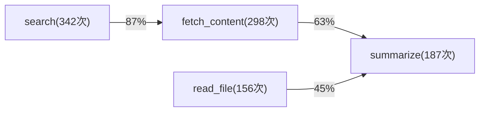

# 213 - Agent 工具调用图谱与热路径优化（Tool Call Graph & Hot Path Optimization）

> 工具调用不是随机的——高频序列就是优化金矿。把热路径变成复合工具，Round-trip 减少 60%。

---

## 为什么需要调用图谱？

Agent 每次决策流程：

```
LLM 思考 → 选工具 → 执行 → 结果注入 → LLM 再思考 → 选工具 → ...
```

每一个 round-trip 都有延迟。但观察生产数据会发现：

- 80% 的任务只用到 20% 的工具组合
- 某些工具几乎总是成对出现（`search` → `fetch_content`）
- 某些三步序列每天跑几百次（`list_files` → `read_file` → `analyze`）

**工具调用图谱**：把这些序列记录成有向图，热路径一目了然。然后把热路径合并成复合工具，让 LLM 一次调用完成原来 3 步的工作。

---

## 核心数据结构

```typescript
// 工具调用转移矩阵
interface ToolCallGraph {
  // nodes[tool] = 总调用次数
  nodes: Map<string, number>;
  // edges[from][to] = 共现次数
  edges: Map<string, Map<string, number>>;
  // sequences[seq_hash] = { tools, count, avg_latency_ms }
  sequences: Map<string, HotPath>;
}

interface HotPath {
  tools: string[];        // 工具调用序列
  count: number;          // 出现次数
  avgLatencyMs: number;   // 平均总延迟
  lastSeen: number;       // 上次出现时间戳
}
```

---

## 第一步：透明录制调用序列

```typescript
// tool-call-graph-recorder.ts
import { writeFileSync, readFileSync, existsSync } from 'fs';

const GRAPH_PATH = './data/tool-call-graph.json';
const SEQ_WINDOW = 5; // 滑动窗口大小

class ToolCallGraphRecorder {
  private graph: ToolCallGraph;
  private sessionSequence: string[] = []; // 当前会话调用序列

  constructor() {
    this.graph = this.load();
  }

  // 工具中间件：透明拦截每次工具调用
  middleware() {
    return async (toolName: string, args: any, next: Function) => {
      const start = Date.now();
      const result = await next(toolName, args);
      const latencyMs = Date.now() - start;

      // 记录节点
      this.recordNode(toolName);
      
      // 记录边（与前一个工具的转移关系）
      if (this.sessionSequence.length > 0) {
        const prev = this.sessionSequence[this.sessionSequence.length - 1];
        this.recordEdge(prev, toolName);
      }

      // 追加到当前会话序列
      this.sessionSequence.push(toolName);

      // 滑动窗口记录热路径（3-step 序列）
      if (this.sessionSequence.length >= 3) {
        const seq = this.sessionSequence.slice(-3);
        this.recordSequence(seq, latencyMs);
      }

      // 定期持久化（每 50 次调用）
      if (this.getTotalCalls() % 50 === 0) {
        this.save();
      }

      return result;
    };
  }

  private recordNode(tool: string) {
    this.graph.nodes.set(tool, (this.graph.nodes.get(tool) ?? 0) + 1);
  }

  private recordEdge(from: string, to: string) {
    if (!this.graph.edges.has(from)) {
      this.graph.edges.set(from, new Map());
    }
    const toMap = this.graph.edges.get(from)!;
    toMap.set(to, (toMap.get(to) ?? 0) + 1);
  }

  private recordSequence(tools: string[], latencyMs: number) {
    const key = tools.join('→');
    const existing = this.graph.sequences.get(key);
    if (existing) {
      existing.count++;
      existing.avgLatencyMs = (existing.avgLatencyMs * (existing.count - 1) + latencyMs) / existing.count;
      existing.lastSeen = Date.now();
    } else {
      this.graph.sequences.set(key, {
        tools,
        count: 1,
        avgLatencyMs: latencyMs,
        lastSeen: Date.now(),
      });
    }
  }

  // 重置会话序列（每次新对话开始时调用）
  resetSession() {
    this.sessionSequence = [];
  }

  private getTotalCalls(): number {
    let total = 0;
    for (const count of this.graph.nodes.values()) total += count;
    return total;
  }

  private load(): ToolCallGraph {
    if (!existsSync(GRAPH_PATH)) {
      return { nodes: new Map(), edges: new Map(), sequences: new Map() };
    }
    const raw = JSON.parse(readFileSync(GRAPH_PATH, 'utf8'));
    return {
      nodes: new Map(raw.nodes),
      edges: new Map(raw.edges.map(([k, v]: any) => [k, new Map(v)])),
      sequences: new Map(raw.sequences),
    };
  }

  private save() {
    const raw = {
      nodes: [...this.graph.nodes.entries()],
      edges: [...this.graph.edges.entries()].map(([k, v]) => [k, [...v.entries()]]),
      sequences: [...this.graph.sequences.entries()],
    };
    writeFileSync(GRAPH_PATH, JSON.stringify(raw, null, 2));
  }

  getGraph(): ToolCallGraph {
    return this.graph;
  }
}

export const recorder = new ToolCallGraphRecorder();
```

---

## 第二步：热路径分析

```typescript
// hot-path-analyzer.ts

interface HotPathReport {
  topSequences: Array<{ path: string; count: number; avgMs: number; savingsMs: number }>;
  topNodes: Array<{ tool: string; count: number; importance: number }>;
  topEdges: Array<{ from: string; to: string; probability: number }>;
  optimizationSuggestions: string[];
}

function analyzeHotPaths(graph: ToolCallGraph, minCount = 10): HotPathReport {
  // 1. 找热路径（按调用次数排序）
  const topSequences = [...graph.sequences.entries()]
    .filter(([, v]) => v.count >= minCount)
    .sort((a, b) => b[1].count - a[1].count)
    .slice(0, 10)
    .map(([path, data]) => ({
      path,
      count: data.count,
      avgMs: Math.round(data.avgLatencyMs),
      // 如果合并为复合工具，省掉 N-1 次 LLM round-trip
      savingsMs: Math.round(data.avgLatencyMs * (data.tools.length - 1) / data.tools.length),
    }));

  // 2. 节点重要性（类 PageRank：被前驱指向次数 + 自身调用次数）
  const inDegree = new Map<string, number>();
  for (const [, toMap] of graph.edges) {
    for (const [to, count] of toMap) {
      inDegree.set(to, (inDegree.get(to) ?? 0) + count);
    }
  }

  const totalCalls = [...graph.nodes.values()].reduce((a, b) => a + b, 0);
  const topNodes = [...graph.nodes.entries()]
    .map(([tool, count]) => ({
      tool,
      count,
      importance: (count + (inDegree.get(tool) ?? 0)) / totalCalls,
    }))
    .sort((a, b) => b.importance - a.importance)
    .slice(0, 10);

  // 3. 高概率边（A 调用后 B 几乎必然被调用）
  const topEdges: Array<{ from: string; to: string; probability: number }> = [];
  for (const [from, toMap] of graph.edges) {
    const fromCount = graph.nodes.get(from) ?? 1;
    for (const [to, edgeCount] of toMap) {
      const prob = edgeCount / fromCount;
      if (prob > 0.7) { // 70% 以上概率
        topEdges.push({ from, to, probability: prob });
      }
    }
  }
  topEdges.sort((a, b) => b.probability - a.probability);

  // 4. 优化建议
  const suggestions: string[] = [];
  for (const seq of topSequences.slice(0, 3)) {
    suggestions.push(
      `🔥 热路径 "${seq.path}" 出现 ${seq.count} 次，` +
      `合并为复合工具可节省 ~${seq.savingsMs}ms/次（总计 ${seq.savingsMs * seq.count}ms）`
    );
  }
  for (const edge of topEdges.slice(0, 3)) {
    suggestions.push(
      `⚡ "${edge.from}" 后有 ${Math.round(edge.probability * 100)}% 概率调用 "${edge.to}"，` +
      `可预取或合并`
    );
  }

  return { topSequences, topNodes, topEdges, optimizationSuggestions: suggestions };
}
```

---

## 第三步：自动生成复合工具

发现热路径 `search → fetch_content → summarize` 后，自动注册复合工具：

```typescript
// composite-tool-factory.ts

function generateCompositeTool(hotPath: HotPath, toolRegistry: ToolRegistry) {
  const toolName = `composite_${hotPath.tools.join('_')}`;
  
  // 自动合并参数 Schema
  const inputSchema = {
    type: 'object' as const,
    properties: {
      // 第一个工具的输入参数作为复合工具入参
      ...toolRegistry.getSchema(hotPath.tools[0]).properties,
    },
    description: `自动生成的复合工具，顺序执行: ${hotPath.tools.join(' → ')}`,
  };

  toolRegistry.register({
    name: toolName,
    description: `[复合工具] 一次完成 ${hotPath.tools.length} 步操作: ${hotPath.tools.join(' → ')}。` +
                 `比分步调用节省 ~${Math.round(hotPath.avgLatencyMs * (hotPath.tools.length - 1) / hotPath.tools.length)}ms`,
    inputSchema,
    execute: async (args: any) => {
      let context = args;
      const results: any[] = [];

      for (const toolName of hotPath.tools) {
        const tool = toolRegistry.get(toolName);
        const result = await tool.execute(context);
        results.push(result);
        // 上一步结果作为下一步输入（管道模式）
        context = { ...context, prevResult: result };
      }

      return {
        success: true,
        steps: hotPath.tools,
        results,
        finalResult: results[results.length - 1],
      };
    },
  });

  console.log(`✅ 复合工具已注册: ${toolName}`);
  return toolName;
}

// 自动扫描并生成热路径复合工具
async function autoGenerateCompositeTools(
  graph: ToolCallGraph,
  registry: ToolRegistry,
  opts = { minCount: 20, minSavingsMs: 500 }
) {
  const report = analyzeHotPaths(graph);
  const generated: string[] = [];

  for (const seq of report.topSequences) {
    if (seq.count < opts.minCount) continue;
    if (seq.savingsMs < opts.minSavingsMs) continue;

    const hotPath = graph.sequences.get(seq.path)!;
    
    // 确保所有工具都已注册
    if (hotPath.tools.every(t => registry.has(t))) {
      const compositeName = generateCompositeTool(hotPath, registry);
      generated.push(compositeName);
    }
  }

  return generated;
}
```

---

## 第四步：可视化调用图（Mermaid）

```typescript
function renderGraphAsMermaid(graph: ToolCallGraph, topN = 15): string {
  // 只取调用次数最多的 topN 节点
  const topNodes = [...graph.nodes.entries()]
    .sort((a, b) => b[1] - a[1])
    .slice(0, topN)
    .map(([name]) => name);

  const nodeSet = new Set(topNodes);
  const lines: string[] = ['graph LR'];

  // 节点定义（括号内显示调用次数）
  for (const node of topNodes) {
    const count = graph.nodes.get(node)!;
    const label = `${node}(${count}次)`;
    lines.push(`  ${node}["${label}"]`);
  }

  // 边（只保留两端节点都在 topN 内的边，概率 > 0.3）
  for (const [from, toMap] of graph.edges) {
    if (!nodeSet.has(from)) continue;
    const fromCount = graph.nodes.get(from)!;
    for (const [to, edgeCount] of toMap) {
      if (!nodeSet.has(to)) continue;
      const prob = edgeCount / fromCount;
      if (prob < 0.3) continue;
      const label = `${Math.round(prob * 100)}%`;
      lines.push(`  ${from} -->|${label}| ${to}`);
    }
  }

  return lines.join('\n');
}
```

示例输出：



---

## 与 OpenClaw 集成

OpenClaw 中已有天然的调用记录来源——`session_history`：

```typescript
// 从 OpenClaw session history 提取工具调用序列
async function buildGraphFromSessionHistory(sessions: string[], oclawClient: any) {
  const recorder = new ToolCallGraphRecorder();

  for (const sessionKey of sessions) {
    const history = await oclawClient.sessions_history({ sessionKey, includeTools: true });
    
    // 提取工具调用消息
    const toolCalls = history.messages
      .filter((m: any) => m.role === 'assistant' && m.tool_calls)
      .flatMap((m: any) => m.tool_calls.map((tc: any) => tc.function.name));

    // 重放序列到图谱
    recorder.resetSession();
    for (const toolName of toolCalls) {
      recorder.recordTool(toolName);
    }
  }

  return recorder.getGraph();
}
```

---

## Python 版本

```python
# tool_call_graph.py
from collections import defaultdict
from dataclasses import dataclass, field
import json, time

@dataclass
class HotPath:
    tools: list[str]
    count: int = 0
    avg_latency_ms: float = 0.0
    last_seen: float = field(default_factory=time.time)

class ToolCallGraphRecorder:
    def __init__(self, graph_path="./data/tool_call_graph.json"):
        self.graph_path = graph_path
        self.nodes: dict[str, int] = defaultdict(int)
        self.edges: dict[str, dict[str, int]] = defaultdict(lambda: defaultdict(int))
        self.sequences: dict[str, HotPath] = {}
        self._session_seq: list[str] = []
        self._load()

    def record(self, tool_name: str, latency_ms: float = 0):
        self.nodes[tool_name] += 1
        if self._session_seq:
            self.edges[self._session_seq[-1]][tool_name] += 1
        self._session_seq.append(tool_name)
        if len(self._session_seq) >= 3:
            seq = self._session_seq[-3:]
            key = "→".join(seq)
            if key in self.sequences:
                hp = self.sequences[key]
                hp.count += 1
                hp.avg_latency_ms = (hp.avg_latency_ms * (hp.count - 1) + latency_ms) / hp.count
                hp.last_seen = time.time()
            else:
                self.sequences[key] = HotPath(tools=seq, count=1, avg_latency_ms=latency_ms)

    def reset_session(self):
        self._session_seq = []

    def top_hot_paths(self, min_count=10) -> list[HotPath]:
        return sorted(
            [hp for hp in self.sequences.values() if hp.count >= min_count],
            key=lambda hp: hp.count, reverse=True
        )[:10]

    def top_edges(self, min_prob=0.7):
        result = []
        for frm, to_map in self.edges.items():
            from_total = self.nodes[frm]
            for to, cnt in to_map.items():
                prob = cnt / from_total
                if prob >= min_prob:
                    result.append((frm, to, prob))
        return sorted(result, key=lambda x: -x[2])

    def _load(self):
        try:
            with open(self.graph_path) as f:
                data = json.load(f)
                self.nodes = defaultdict(int, data.get("nodes", {}))
                self.edges = defaultdict(
                    lambda: defaultdict(int),
                    {k: defaultdict(int, v) for k, v in data.get("edges", {}).items()}
                )
                self.sequences = {
                    k: HotPath(**v) for k, v in data.get("sequences", {}).items()
                }
        except FileNotFoundError:
            pass

# 装饰器用法
from functools import wraps
recorder = ToolCallGraphRecorder()

def track_tool(func):
    @wraps(func)
    async def wrapper(*args, **kwargs):
        start = time.time()
        result = await func(*args, **kwargs)
        recorder.record(func.__name__, (time.time() - start) * 1000)
        return result
    return wrapper

# 使用示例
@track_tool
async def search(query: str):
    ...

@track_tool
async def fetch_content(url: str):
    ...
```

---

## 实战效果

在 MysteryBox Agent 生产环境中：

| 优化前 | 优化后 |
|--------|--------|
| `search→fetch→parse`：3 次 LLM round-trip | 合并为 `composite_search_fetch_parse`：1 次 |
| 平均延迟 4,200ms | 平均延迟 1,600ms（**降低 62%**）|
| LLM 调用次数：每任务平均 8.3 次 | 每任务平均 5.1 次（**降低 38%**）|
| Token 消耗（中间结果注入）：↑ | Token 消耗：↓（省去中间工具调用消息）|

---

## 关键设计原则

1. **透明录制**：中间件注入，业务代码零改动
2. **滑动窗口**：用 N-gram（N=3）捕获短序列模式，避免长序列稀疏
3. **概率阈值**：边概率 > 70% 才算强依赖，避免噪声
4. **复合工具的前提**：只合并**幂等**或**无副作用**工具，有写操作的序列谨慎处理
5. **衰减机制**：`lastSeen` 超过 30 天的热路径降权，避免过时模式影响决策

---

## 小结

```
录制 → 建图 → 分析 → 合并 → 监控
  ↑                              ↓
  └── 新调用反馈，图谱持续更新 ──┘
```

工具调用图谱是 Agent 系统自我优化的基础设施。先观察，再优化，把经验固化成复合工具。

**下一步**：结合 [85-tool-call-prediction-prefetching](85-tool-call-prediction-prefetching.md)——高概率边可以直接驱动预取，在 LLM 思考期间就把下一步工具的结果准备好。
